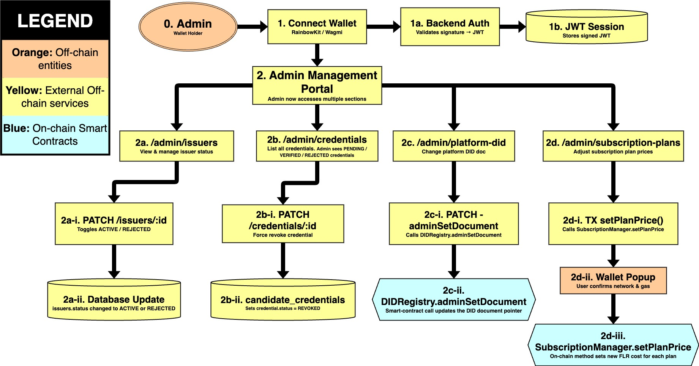

# FlareCred – AI-Assisted Talent Verification on Flare


**FlareCred** unites _candidates_, _issuers_, _recruiters_ and an _admin super-role_ inside a single Next 14 application that mints deterministic Flare DIDs, anchors Verifiable Credentials as ERC-721 NFTs and settles Base or Plus subscriptions in FLR with live USD pricing from the FTSO oracle. Under the hood, issuer approvals replay EVM / JSON-API / payment proofs through the on-chain FlareCred Verifier (FDC) while candidate Skill-Check quizzes pull provable randomness from Flare’s RNG.

## 🎯 User-Journey Overview

1.  **Wallet Connect → JWT** – the `/connect-wallet` modal has the wallet sign a nonce; the backend exchanges it for a temporary, role-agnostic JWT and redirects to the proper dashboard namespace.
2.  **Workspace Bootstrap & DID Mint** – the server ensures a single `teams` row exists for the `walletAddress`. If the workspace has no DID yet, `<RequireDidGate>` redirects the user to `/<role>/create-did`; the call to `DIDRegistry.createDID()` is made _only when the user presses “Create DID”_. A user (or their owner) therefore _must_ mint a DID before uploading credentials, requesting verification, paying subscriptions or issuing NFTs.
3.  **Role Guard** – edge middleware in `lib/auth/middleware.ts` forces the session into one of `/candidate`, `/issuer`, `/recruiter` or `/admin`. Reaching a route outside your role yields `403`.

### 👤 Candidate  (`/candidate/*`)

*   **Profile** – edit bio, avatar and social links.
*   **Credential Upload**
    *   UNVERIFIED – user leaves the “issuer” field blank.
    *   PENDING – user selects an issuer to review the credential.
    *   Issuer _Approve_ → VC hashed, `CredentialNFT.mintCredential()`, status → VERIFIED, Flarescan link and VC JSON exposed.
    *   Issuer _Reject_ → status → REJECTED, no on-chain record.
*   **AI Skill-Check** – provably-random quiz whose question order is seeded by Flare RNG. After GPT-4o grades the answer, the backend _only_ returns an ECDSA signature from a PLATFORM\_ROLE account when the score ≥ 70. `CredentialNFT.mintCredential()` requires that signature, so any attempt to call the contract directly—without passing the quiz—reverts, eliminating "self-mint” cheating.
*   **AI Profile Summary** – one-click GPT-4o service that produces a concise 120-word third-person overview; the result is cached via a SHA-256 hash of the bio + credential list and limited to two generations per UTC day.
*   **Highlights** – drag up to 5 _Experience_ and 5 _Project_ credentials onto the public profile.
*   **Activity Log** – DID creation, credential lifecycle, subscription events.

### 🏢 Issuer  (`/issuer/*`)

*   Submit organisation details (logo, domain, category, industry) for admin approval.
*   **Verification Requests**
    *   _Approve_ – on-chain proof replay via `FlareCredVerifier`, NFT mint, status → VERIFIED.
    *   _Reject_ – status → REJECTED, feedback stored.
    *   _Unverify_ – move a previously-verified credential back to UNVERIFIED if a proof is later disputed.
*   Credential panels show GitHub / payment proofs and a Flarescan link.

### 🗂 Recruiter  (`/recruiter/*`)

*   Full-text talent search with verified-only toggle and skill-score sliders.
*   Create Kanban-style pipelines; drag candidates through custom stages.
*   Inline analytics: credential counts, average quiz scores, unique issuer tally.
*   **Why Hire AI Fit Summary** – GPT-4o returns a structured JSON with five 12-word selling points, a best-pipeline recommendation, and balanced pros/cons; outputs are cached per recruiter × candidate using SHA-256 hashes of the profile and pipeline list, with automatic schema validation and up to three retries for compliance.
*   Export pipeline snapshots or share read-only links with hiring managers.

### 🛠 Admin  (`/admin/*`)

*   Approve or reject issuer applications (rejections store a reason).
*   Review every credential and force-revoke if its proof fails re-validation.
*   User management: role upgrades, soft-delete.
*   Update FLR plan prices and rotate the platform DID used for automated issuance.

## 🚀 Quick Start

1.  **Clone the repository**
    
    ```
    git clone https://github.com/syntaxsurge/FlareCred.git
    cd FlareCred
    ```
    
2.  **Install dependencies**
    
    ```
    pnpm install
    ```
    
3.  **Create environment files**
    
    ```
    cp .env.example .env
    cp blockchain/.env.example blockchain/.env
    ```
    
    Populate the placeholders—at minimum a working `POSTGRES_URL` and a Flare RPC endpoint (e.g. Coston 2).
    
4.  **Start Postgres locally (skip if you use a managed DB)**
    
    ```
    docker compose up -d database
    ```
    
    This boots Postgres 16 on `localhost:54322`. Adjust `POSTGRES_URL` if you change the port.
    
5.  **Run migrations & seed demo data**
    
    ```
    pnpm db:reset
    ```
    
6.  **Launch the dev server**
    
    ```
    pnpm dev
    ```
    
    Open [http://localhost:3000](http://localhost:3000) and connect a wallet to explore the app.
    

## 🗄 Database Options

A convenience `docker-compose.yml` ships with the project. Prefer a hosted service instead? Simply set `POSTGRES_URL` to the remote connection string and skip the Docker step. All migrations live in `lib/db/migrations`.

## 🔗 Blockchain Contracts

Contract compilation, testing and deployment are handled by a self-contained Hardhat workspace under `blockchain/`. Follow the detailed instructions in [blockchain/README.md](blockchain/README.md) if you wish to deploy your own instances. For local UI hacking, the default public contract addresses in `.env.example` are sufficient.

## 🏆 Hackathon Tracks & Protocol Usage

*   **Flare Time Series Oracle (FTSO)** – Every subscription price button calls `FtsoHelper.flrUsdPriceWei()` to display the live FLR → USD conversion and to calculate the exact `msg.value` for `SubscriptionManager.paySubscription()`. The UI disables payments when the feed is older than one hour, proving we never rely on stale data.
*   **Random Number Generator (RNG)** – Skill-Check quizzes request a bounded random seed from `RngHelper.randomMod()`. The seed is stored with each attempt so recruiters can audit that question order was truly random.
*   **Flare Data Connector (FDC)** – Issuers verify candidate proofs on-chain via `FlareCredVerifier.verify*` helpers (EVM tx, JSON API, Address-validity, Payment). Only a successful check lets the issuer mint a hashed Verifiable Credential through `CredentialNFT.mintCredential()`.
*   **Bonus Track – Best External Data Source** – Candidates may paste a GitHub repository URL. A background worker fetches commit statistics, wraps them in an FDC JSON proof and feeds that into the same verification pipeline—demonstrating a novel web2 data source bridged to Flare.

## 🏗 Architecture Overview

*   **Frontend** – Next.js 14 App Router, React Server & Client Components, shadcn/ui + Tailwind.
*   **Backend** – PostgreSQL (Drizzle ORM), server actions with Zod validation, edge middleware for role guards, background workers for GitHub metrics & IPFS pinning.
*   **Smart Contracts** – Identity (`DIDRegistry`), Credentials (`CredentialNFT`), Billing (`SubscriptionManager`), Oracle & RNG helpers plus the `FlareCredVerifier` delegate for FDC proof checks.
*   **Data Flow** – UI → Server Action → Drizzle → Flare Contracts. On-chain hashes/timestamps are the source of truth; Postgres is a query cache.

### 📊 Detailed Architecture Diagrams  

#### Candidate Flow  


#### Issuer Flow  


#### Admin Flow  


#### Recruiter Flow  


#### Subscription & Pricing Pipeline  


## 🙏 Need Help?

Open an issue or start a discussion on GitHub — we welcome questions, feedback and PRs.